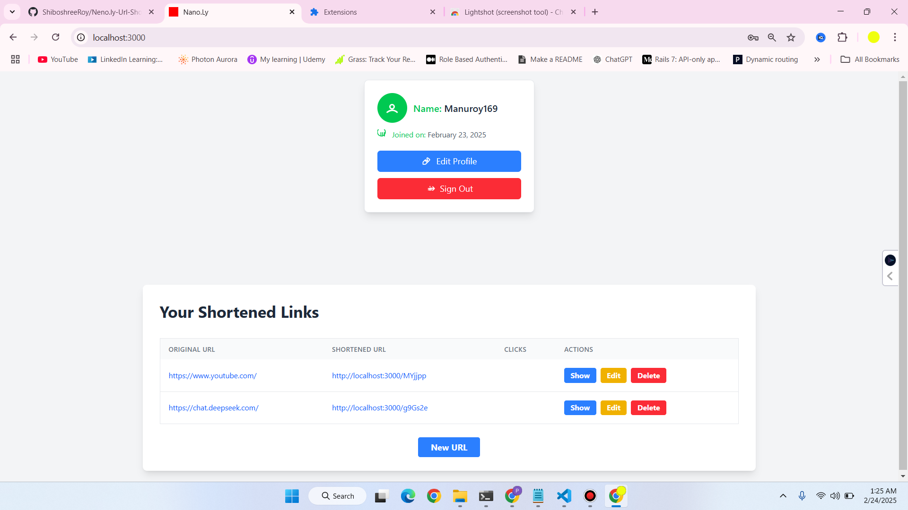

# Neno.ly - Powerful URL Shortener

 <!-- Replace with your project banner image -->

Neno.ly is a powerful URL shortener designed to simplify sharing long web links. By converting lengthy URLs into short, easy-to-remember links, Neno.ly helps improve user experience, making it ideal for social media, messaging, and online marketing. It offers fast, reliable, and secure link shortening, making it a valuable tool for anyone looking to share links more efficiently.

---

## Features

- **Shorten Long URLs**: Convert lengthy links into short, manageable ones.
- **Easy to Use**: Simple and intuitive interface for quick link shortening.
- **Secure**: Encrypted links to ensure data privacy and security.
- **Analytics**: Track link performance with click-through rates and user engagement.
- **Customizable**: Option to create custom short URLs for branding purposes.
- **Fast and Reliable**: Built for speed and reliability, ensuring seamless user experience.

---

## Demo

Check out a quick demo of Neno.ly in action:

[]<!-- Replace with your demo video link -->

---

## Getting Started

### Prerequisites

Before you begin, ensure you have the following installed:

- Ruby (version 3.4.2)
- Rails (version 7.2.2.1)
- PostgreSQL (or your preferred database)
- Node.js and Yarn (for asset management)

### Installation

1. **Clone the repository:**

   ```bash
   git clone https://github.com/ShiboshreeRoy/Neno.ly-Url-Shortner.git
   cd neno.ly